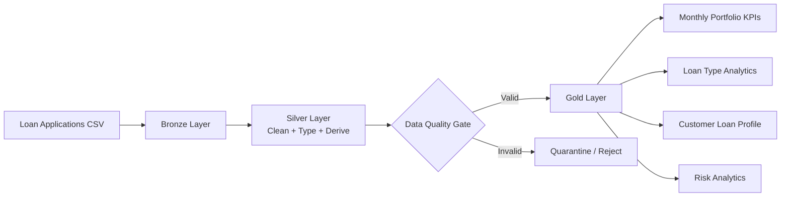

# Banking Loan Analytics with PySpark

A portfolio-ready **Data Engineering** project demonstrating **PySpark + Medallion Architecture** for loan application, approval, customer exposure and credit-risk analytics.

> **Portfolio level:** Simple → Intermediate, with production-oriented design patterns.

## Business Problem

A bank receives loan applications across Home, Personal, Auto, Education and Business products. The analytics team needs trusted datasets to understand approval trends, loan demand, customer exposure, product performance and risk segmentation.

## Architecture



## Technology Stack

- Python 3.10+
- PySpark 3.5+
- Parquet
- pytest
- GitHub Actions
- Medallion Architecture

## Repository Structure

```text
banking-loan-analytics-pyspark/
├── data/
│   └── raw/
│       └── loan_applications.csv
├── notebooks/
│   └── 04_end_to_end_pipeline.py
├── src/
│   └── pipeline.py
├── tests/
│   ├── conftest.py
│   └── test_pipeline.py
├── docs/
│   ├── architecture.md
│   ├── business_requirements.md
│   ├── data_dictionary.md
│   └── interview_questions.md
├── .github/workflows/
│   └── tests.yml
├── requirements.txt
├── .gitignore
└── README.md
```

## Medallion Design

### Bronze

Loads the source loan application data with minimal transformation. In a production implementation this layer would preserve source fidelity in ADLS/Delta.

### Silver

Creates trusted application data by:

- Standardizing data types
- Converting dates
- Removing duplicate `loan_id` records
- Filtering invalid monetary values
- Deriving `income_to_loan_ratio`
- Deriving a simple `risk_band`
- Deriving `application_month`

### Gold

Creates business-facing datasets:

| Dataset | Purpose |
|---|---|
| Monthly KPIs | Applications, approvals, rejection rate, requested/approved amount and MoM movement |
| Loan Type Analytics | Product-level approval and credit characteristics |
| Customer Loan Profile | Customer approved exposure and ranking |
| Risk Analytics | Application distribution by risk band |

## PySpark Concepts Demonstrated

- DataFrame API
- Explicit transformations
- Type casting
- `withColumn`
- `when/otherwise`
- `dropDuplicates`
- Filtering
- GroupBy aggregations
- Conditional aggregation
- Window functions
- `dense_rank`
- `lag`
- Month-over-month analysis
- Reusable transformation functions
- PySpark unit testing

## Key Business Questions

1. What is the monthly loan approval rate?
2. Which loan products receive the highest demand?
3. Which products have the highest approval rate?
4. What is the total approved exposure by customer?
5. Who are the top customers by approved loan amount?
6. How does approved lending change month over month?
7. How are applications distributed across risk bands?
8. How do credit scores and interest rates vary by product?

## Running the Project

```bash
python -m venv .venv

# Windows
.venv\Scripts\activate

# Linux/macOS
source .venv/bin/activate

pip install -r requirements.txt
pytest -q
python notebooks/04_end_to_end_pipeline.py
```

Gold and Silver Parquet outputs are written under `output/`, which is intentionally excluded from Git.

## Data Quality Rules

The project validates/handles core rules around:

- Unique loan identifiers
- Non-null customer identifiers
- Positive loan amount
- Positive annual income
- Valid application status
- Expected loan product values
- Credit-score range validation

The current pipeline demonstrates the core validation pattern; a production implementation should send invalid records to a quarantine Delta table rather than silently discard them.

## Production Azure Databricks Architecture

The local implementation maps to Azure as follows:

```text
ADLS Gen2
   ↓
Bronze Delta Tables
   ↓
Azure Databricks / PySpark
   ↓
Silver Delta Tables
   ↓
DQ / Quarantine
   ↓
Gold Delta Tables
   ↓
Power BI / SQL / ML / APIs
```

Recommended production components:

- **ADLS Gen2** — landing/storage
- **Azure Databricks** — Spark processing
- **Delta Lake** — ACID tables and reliable pipelines
- **Unity Catalog** — access control, lineage and governance
- **Microsoft Purview** — enterprise catalog/governance integration
- **Azure Data Factory / Databricks Workflows** — orchestration
- **Azure Key Vault** — secrets
- **Power BI** — consumption

## Scaling Considerations

For a production-scale portfolio:

- Process incrementally using application date/watermarks.
- Use Delta Lake instead of plain Parquet tables.
- Partition only on useful low/medium-cardinality columns.
- Broadcast small reference dimensions.
- Avoid unnecessary shuffles.
- Select only required columns.
- Use Spark `explain()` to identify expensive stages.
- Implement data-quality quarantine and reconciliation.
- Add pipeline SLA, freshness and volume monitoring.

## Interview Explanation

> "I built a PySpark Medallion pipeline for a banking loan portfolio. Bronze preserves incoming applications, Silver standardizes and enriches the records with affordability and risk attributes, and Gold creates business datasets for portfolio, product, customer and risk analytics. I used window functions for customer ranking and month-over-month analysis and added automated tests and CI. In Azure, I would implement the layers as Delta tables on ADLS Gen2 with Databricks, Unity Catalog and orchestration through ADF or Databricks Workflows."

## Disclaimer

All data is synthetic and created solely for learning, portfolio demonstration and interview discussion. No real customer, credit bureau or banking information is included.
