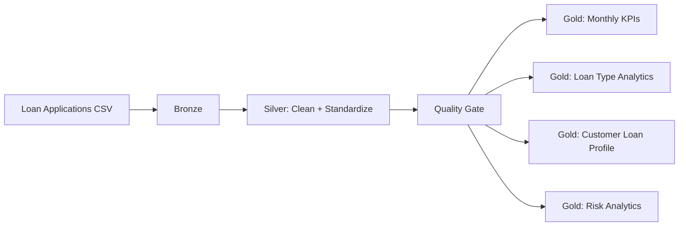

# Architecture

## Layers

- **Bronze:** raw loan application records.
- **Silver:** typed, deduplicated and validated applications with derived risk and affordability features.
- **Gold:** business-facing datasets for portfolio, customer, product and risk analytics.

## Production Azure Mapping

| Local project | Azure production equivalent |
|---|---|
| CSV | ADLS Gen2 landing zone |
| PySpark | Azure Databricks |
| Parquet | Delta Lake |
| Local pipeline | Databricks Workflow / ADF |
| Tests | CI/CD + Databricks Jobs |
| Data governance | Unity Catalog + Microsoft Purview |
